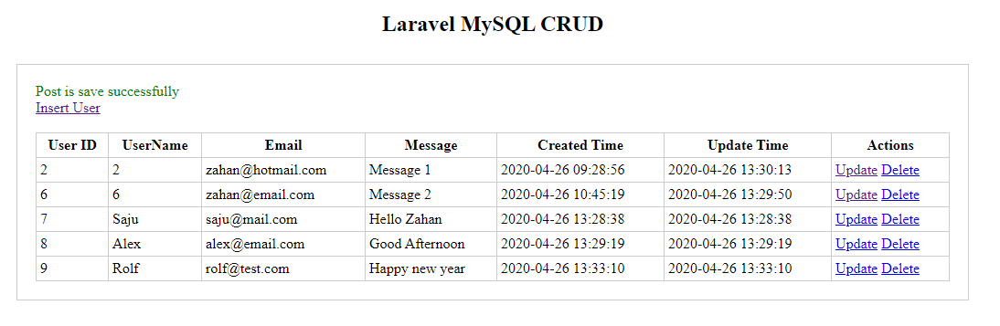
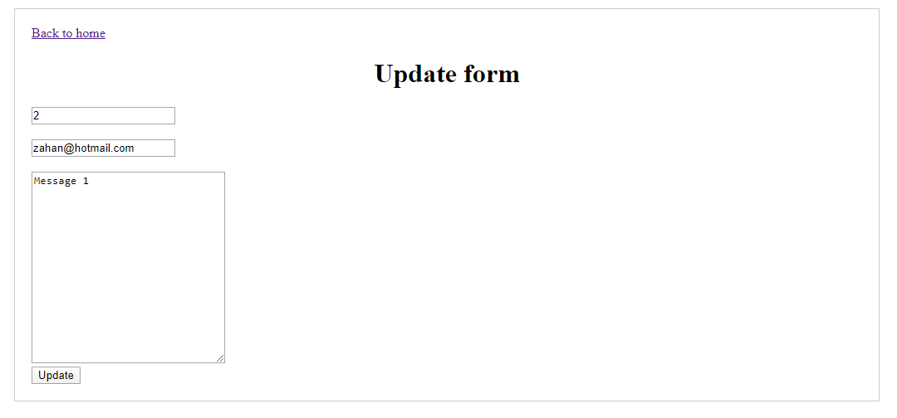
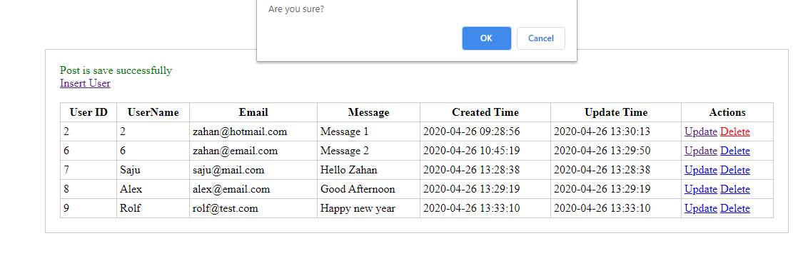

## Laravel MySQL CRUD

This application is dedicated to the MySQL database. There is no CSS or external framework used just because of the simplicity. You can download and use this file without any obligation. I have added some screenshot below.

## Screenshot of post list

## Screenshot of post insert

## Screenshot of post update

## Screenshot of post delete

## License

Code are free to use  under the [MIT license](https://opensource.org/licenses/MIT).

